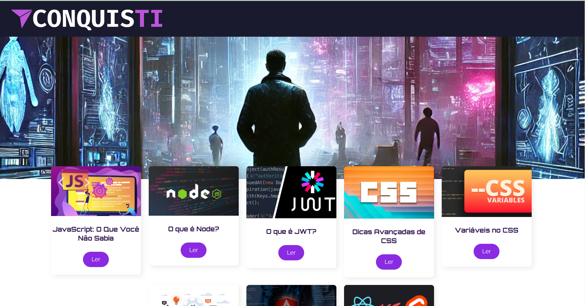

# CyberVerse

Este projeto é um blog desenvolvido utilizando React. Ele permite que os usuários visualizem posts e conteúdos dinâmicos, com links que abrem em uma nova guia para uma melhor experiência de navegação.

## Interface

  

## Sumário

- [Tecnologias Utilizadas](#tecnologias-utilizadas)
- [Status](#status)
- [Descrição](#descrição)
- [Funcionalidades](#funcionalidades)
- [Explicação](#explicação)
- [Como Usar](#como-usar)
- [Autor](#autor)

## Tecnologias Utilizadas

  

    
  

  

    
  

## Status

<!-- -->

## Descrição

Este projeto é um blog desenvolvido utilizando React. Ele permite que os usuários visualizem posts e conteúdos dinâmicos, com links que abrem em uma nova guia para uma melhor experiência de navegação.

## Funcionalidades

Exibição de posts com título, imagem de capa e conteúdo.
Renderização de conteúdo Markdown.
Links no conteúdo que abrem em nova guia.
Recomendação de outros posts relacionados.
Estrutura de rotas para navegação entre diferentes páginas do blog.

## Explicação

Este projeto utiliza componentes React para renderizar posts de um blog. Os componentes principais incluem PostModelo para a exibição dos posts, PostCard para a listagem de posts recomendados, e PaginaPadrao para a estrutura básica da página.

## Autor

Desenvolvido por Diego Franco
